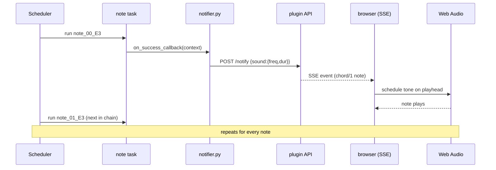

# Sound Notifier — play tunes with Airflow

A custom Apache Airflow plugin that turns task completions into **sound in your
browser**. When a task finishes, Airflow sends the note it should play to a small
API bundled in the plugin, which pushes it over a live stream to a React app on
the Airflow UI. The browser's Web Audio engine then synthesizes the tone.

On top of the basic "beep when a task finishes" idea, the project can play real
tunes — *Seven Nation Army*, *Twinkle Twinkle*, *Stand By Me*, *Ode to Joy* — as
single notes, chords, or full polyphonic arrangements (melody + harmony + bass).

---

## What it does

- Every task can declare a `sound` (frequency, duration, waveform, volume) in its
  `params`. When it succeeds/fails, a callback ships that sound to the browser.
- The browser holds one long-lived `AudioContext` and schedules each note on the
  audio clock, so notes are click-free and (where possible) tightly timed.
- Several delivery modes are supported: one note per task, explicit chords,
  gapless melodies, and fully overlapping polyphonic scores.

---

## Architecture

```mermaid
flowchart LR
    subgraph airflow["Airflow (Docker containers)"]
        task["Task finishes<br/>(params.sound)"]
        cb["on_success_callback<br/>notify_task_success<br/>(notifier.py)"]
        task --> cb
    end

    subgraph plugin["sound_notifier plugin — FastAPI apps"]
        api["/sound-notifier-api<br/>/notify /notify-chord<br/>/notify-melody /notify-score"]
        batch["chord batching<br/>(window + max sounds)"]
        sse["/events (SSE stream)"]
        api --> batch --> sse
    end

    subgraph browser["Airflow UI — React plugin"]
        app["Sound Beep app<br/>(beep_app.js)"]
        audio["Web Audio API<br/>AudioContext + limiter"]
        app --> audio --> spk["speakers"]
    end

    cb -- "HTTP POST (requests)" --> api
    sse -- "Server-Sent Events" --> app
```



The key idea: **Airflow can't make sound** (the workers run in Docker with no
audio device), so the plugin moves the sound generation to the one place that
*does* have speakers — the browser that's already showing the Airflow UI.

---

## How it works

### Components

| File | Role |
| --- | --- |
| `sound_notifier/notifier.py` | The task callbacks. Reads `params.sound` and POSTs it to the plugin API.|
| `sound_notifier_plugin.py` | Registers the FastAPI apps + React app via `AirflowPlugin`. Holds the batching logic and the SSE stream. |
| `sound_notifier/static/beep_app.js` | The React component mounted on the Airflow UI. Subscribes to the SSE stream and schedules notes with the Web Audio API. |

### API endpoints (`/sound-notifier-api`)

| Endpoint | Emits event | Use |
| --- | --- | --- |
| `POST /notify` | `chord` | One task = one note. Near-simultaneous notes get batched into a chord. |
| `POST /notify-chord` | `chord` | State a chord explicitly (all voices in one request). |
| `POST /notify-melody` | `melody` | An ordered note list scheduled back-to-back, gaplessly. |
| `POST /notify-score` | `score` | A full polyphonic score; each note has an absolute `start`, so layers overlap. |
| `GET /events` | — | The SSE stream the browser subscribes to. |

### Browser scheduling

The React app keeps a running "playhead" (`nextStartTimeRef`) on the
`AudioContext` clock. Instead of playing each note the instant its event
arrives (which would inherit network/scheduler jitter), it schedules notes
against that playhead so consecutive notes stay clean:

- **chord** → all voices start at the same time.
- **melody** → notes are laid end-to-end (`duration + gap`).
- **score** → each note is scheduled at its own absolute `start` offset, so a
  held harmony chord keeps ringing while the melody moves above it.

---

## Example: a *slow* DAG

The "slow" DAGs create **one Airflow task per note** and chain them with `>>`.
Each note plays from that task's success callback. It's the clearest way to
*see* the pipeline drive the sound — every note is a real task in the graph.

```python
# dags/seven_nation_army_slow_dag.py  (trimmed)
from airflow.sdk import dag, task
from pendulum import datetime
from sound_notifier.notifier import notify_task_failure, notify_task_success

_RIFF = [("E3", 164.81, 0.45), ("G3", 196.00, 0.15), ...]  # (label, hz, seconds)

@dag(
    start_date=datetime(2025, 4, 1),
    schedule=None,
    default_args={
        "on_success_callback": notify_task_success,   # fires the note
        "on_failure_callback": notify_task_failure,
    },
)
def seven_nation_army_slow_dag():
    def _make_note_task(idx, label, freq, duration):
        @task(
            task_id=f"note_{idx:02d}_{label}",
            # the note this task should play, read by the callback
            params={"sound": {"frequency": freq, "duration": duration,
                              "waveform": "sine", "sequential": True}},
        )
        def play_note():
            print(f"note {label}")
        return play_note()

    notes = [_make_note_task(i, l, f, d) for i, (l, f, d) in enumerate(_RIFF)]
    for i in range(len(notes) - 1):
        notes[i] >> notes[i + 1]   # play notes one after another
```

What happens when you trigger it:



> **Trade-off:** in a slow DAG the *rhythm is the scheduler*. Each task carries
> ~1–5 s of start-up/scheduling overhead, and that timing is jittery — so the
> tune has audible gaps. That's inherent: a note doesn't exist until its task
> finishes. For a tight tune, use the single-task variants
> (`..._dag`, `..._melody_dag`, `..._harmony_dag`) which compute the timing in
> the browser instead of from task completions.

---

## Airflow features used

- **Custom plugin** (`AirflowPlugin`) registering three integration points:
  - `fastapi_apps` — the notify API and the static-asset server (Airflow 3's
    FastAPI plugin surface).
  - `react_apps` — the "Sound Beep" page injected into the Airflow 3 React UI.
- **TaskFlow API** — `@dag` / `@task` from `airflow.sdk`.
- **Task `params`** — each task carries its own `sound` payload.
- **Task callbacks** — `on_success_callback` / `on_failure_callback` (set once in
  `default_args`) are what actually trigger a note.
- **Dependencies & helpers** — `>>` for sequential notes; `cross_downstream` in
  the harmony DAGs so a beat's parallel voices all finish before the next beat.
- **Dynamic task generation** — tasks built in loops/comprehensions from a riff.

---

## What was hard

1. **"How do I make Airflow produce noise"**
   Workers have no audio devices is something I did not initially realize, so after a few attempts at driving audio from a DAG and FastAPI endpoint on the worker, I could not produce sound from a DAG task. I then realized that the browser can by hosting a component in the UI using a React app. So, I added a small JS script to the Airflow UI that listens to an SSE stream and plays sounds client-side.

2. **"Sounds are too far apart from each other"**
   As mentioned before, in the slow DAG the rhythm is the scheduler, so tuning the scheduler was needed (`SCHEDULER_IDLE_SLEEP_TIME`, the mini-scheduler
   `SCHEDULE_AFTER_TASK_EXECUTION`, executor/parallelism), but per-task process
   startup sets a hard floor. Ideally, you don't want to fight the scheduler for musical timing, instead the move timing into the data/browser but for this project having each task produce its own sound would be more graphical.

3. **"The sounds have gaps or play too close together."**
   Root cause: timing was driven by *task-completion* events, which are jittery,
   and the chord-batcher would sometimes stack two *sequential* notes into one
   simultaneous chord. Fixes: a browser-side playhead to absorb jitter, and a
   `sequential` flag so melody notes are never merged into a chord.

---

## Configuration

Set as environment variables (e.g. in `.env`):

| Variable | Default | Meaning |
| --- | --- | --- |
| `SOUND_NOTIFIER_API_BASE_URL` | `http://api-server:8080` | Where callbacks POST from inside the Docker network. |
| `SOUND_NOTIFIER_CHORD_WINDOW_SECONDS` | `0.1` | How close events must land to be batched into a chord. |
| `SOUND_NOTIFIER_MAX_CHORD_SOUNDS` | `3` | Max notes merged into one chord. |

---

## Run it locally

Requires the [Astro CLI](https://docs.astronomer.io/astro/cli/install-cli) and Docker.

```bash
# from astro-contest/learning-airflow
astro dev start          # builds and starts the Airflow containers
```

1. Open the Airflow UI at <http://noisy-airflow.localhost:6563>.
2. Trigger a DAG (e.g. `seven_nation_army_slow_dag` to hear the pipeline, or
   `ode_to_joy_harmony_dag` for the full arrangement) and listen.

After editing the plugin (Python API or `beep_app.js`), reload it with:

```bash
astro dev restart
```
